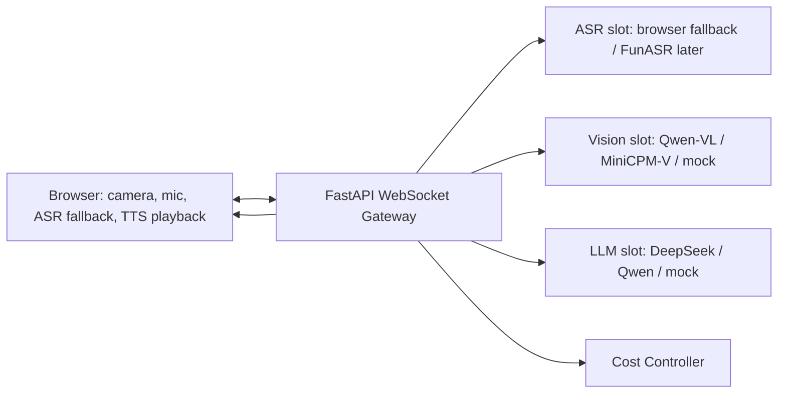

# AI 视觉对话助手设计文档

## 1. 用户故事

计划实现：

- 用户可以打开摄像头与麦克风，看到本地视频预览。
- 用户说话时可以看到实时转写。
- AI 可以流式生成文本，并尽快开始语音播报。
- 用户问视觉问题时，系统能抓取当前关键帧并基于画面回答。
- 用户插话时，系统取消当前回复与待播语音。
- 评委可以看到音频时长、关键帧数量、缓存命中、估算 token、打断次数等成本指标。

当前实现：

- 已实现摄像头/麦克风授权与预览。
- 已实现 WebSocket Gateway 长连接与流式事件协议。
- 已实现 AudioWorklet 音频分片上传，默认约 40ms 一帧。
- 已实现浏览器 Web Speech API 低成本转写兜底，并通过 Gateway 回推 `asr.partial` / `asr.final`。
- 已实现 LLM token 流式输出；未配置云模型时使用 mock streaming。
- 已实现浏览器 SpeechSynthesis 分句 TTS，后端以 `tts.audio.chunk` 事件推送待播句子。
- 已实现视觉关键帧上传、画面变化检测、视觉摘要缓存与 mock/VL API 适配。
- 已实现成本面板与打断取消。

## 2. 混合流式架构

系统采用混合流式，而非全量连续视频上传：

- 麦克风音频：全流式上传到 Gateway，用于 VAD、成本统计和未来服务端 ASR。
- ASR：默认使用浏览器 Web Speech API 低成本兜底，结果仍通过 Gateway 标准化回推。
- LLM：后端使用 OpenAI-compatible streaming 接口；无 Key 时使用 mock stream。
- TTS：首版使用浏览器 SpeechSynthesis，后端按短句发送 `tts.audio.chunk`。
- 视频：只上传关键帧，触发条件包括视觉关键词、画面变化、时间间隔。

## 3. 成本控制技巧

想到的技巧：

- 不上传连续视频，只上传关键帧。
- 静音或低能量音频不触发推理。
- 画面相似时复用旧视觉摘要。
- 视觉关键词触发高优先级关键帧。
- 用户打断后立即取消 LLM 与 TTS。
- 对话历史只保留短窗口和视觉摘要。
- ASR/TTS 优先用浏览器能力或本地服务，降低云调用成本。
- 云模型统一通过可替换适配层，便于替换低价模型。

实际采用：

- AudioWorklet 上传音频帧，同时统计有效语音时长。
- 前端画面变化检测，静止画面 10-15 秒最多分析一次。
- 视觉摘要缓存和缓存命中统计。
- LLM 流式输出按句切分，TTS 只播已生成短句。
- `speech.cancel` 会取消当前后端生成任务和浏览器 TTS 队列。
- 成本面板展示视觉帧、缓存、语音秒数、估算 token、TTS 字符数、打断次数。

## 4. 高并发网关考虑

当前代码是单机可演示实现，但接口按生产网关方式设计：

- WebSocket 连接以 session 为单位。
- Gateway 不存放长期用户数据。
- 模型服务通过适配层隔离，未来可拆为独立 ASR/VL/LLM/TTS 服务。
- 成本与限流状态集中在 session cost state；生产可迁移到 Redis。
- GPU 推理服务可独立扩容，不让 Gateway 处理重计算。

生产化升级：

- 使用 Redis 存储 session、限流计数、视觉摘要缓存。
- 使用队列隔离视觉和 TTS 慢任务。
- Gateway 前置 Nginx/Cloudflare/API Gateway。
- 服务端 ASR 替换浏览器 ASR 兜底，保持事件协议不变。

## 5. 模型默认选型

普通笔记本 + 云 API 推荐：

- ASR：浏览器 Web Speech API 兜底；后续接 FunASR/SenseVoice streaming。
- 视觉：Qwen-VL OpenAI-compatible API；无 Key 时 mock。
- LLM：DeepSeek/Qwen OpenAI-compatible streaming；无 Key 时 mock。
- TTS：浏览器 SpeechSynthesis；后续接 CosyVoice/GPT-SoVITS chunk。

该设计避免依赖 OpenAI Realtime 或一体化视频对话 API，重点展示实时协议、模型编排和成本控制。
