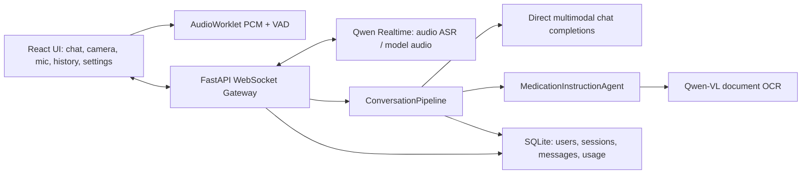

# AI 视觉对话助手设计文档

## 1. 设计目标

本项目目标是实现一个浏览器端多模态对话助手：用户可以打开摄像头与麦克风，让 AI 听到用户说话，并在用户明确需要视觉能力时理解当前画面，给出自然、低延迟、可朗读的回应。

本轮设计结论是：**语音交互和视觉输入必须解耦**。VAD 负责判断用户是否在说话、是否需要打断、何时提交语音；VAD 不应默认等同于“需要发送摄像头画面”。视觉图片只应在用户明确触发视觉能力时发送，以降低误触发、成本和 Realtime 顺序错误。

## 2. 用户故事

计划实现：

- 用户可以登录并管理历史会话。
- 用户可以分别开启摄像头和麦克风。
- 用户可以通过语音或文本与 AI 对话。
- 用户可以看到实时转写、流式回复和语音播放状态。
- 用户可以选择 Realtime 音色。
- 用户可以在 AI 播报时插话，系统立即停止旧回复。
- 用户明确需要视觉能力时，AI 能基于当前摄像头画面回答。
- 用户可以用视觉快捷提问触发描述画面、识别文字、检查异常、解释变化。
- 用户询问特定领域知识时，例如查看药品说明书，系统自动进入Agent流程，调用相关工具。
- 用户可以查看模型消耗统计，包括音频、图片、token、TTS 和事件记录。

当前实现：

- 已实现 React + FastAPI WebSocket Gateway 的实时会话。
- 已实现摄像头预览和麦克风 AudioWorklet PCM 上传。
- 已实现 Qwen Realtime 音频链路，并保留浏览器 Web Speech API ASR 兜底。
- 已实现模型音频流播放、浏览器 TTS fallback、AI 回复复制/朗读/赞踩。
- 已实现 ChatGPT 风格会话页面、历史会话管理、用户菜单、API Key 管理和模型消耗统计页。
- 已实现 SQLite 用户、会话、消息、模型配置、成本快照和 usage events 持久化。
- 已实现 Qwen Realtime image append guard：云端 Realtime session 没有成功 append audio 前，不向其 append image。
- 已实现药品说明书 Agent：保守意图识别、后端请求截图、OCR、质量门、安全回答和短期追问上下文。

## 3. 交互策略

### 3.1 摄像头与麦克风

- 摄像头按钮只负责授权、开启预览和关闭摄像头。
- 麦克风按钮负责开启实时语音会话、上传音频、触发 VAD、接收 ASR 和打断逻辑。
- 摄像头开启不代表每轮消息都要带图片。
- 麦克风检测到用户开口不代表需要抓图。

### 3.2 什么时候发送图片

默认策略：

- 普通文本消息：不发送图片。
- 普通语音消息：不因 VAD `speechStart` 自动发送图片。
- 用户明确选择视觉能力时，才抓取当前帧。

推荐保留的图片发送时机：

- 用户点击视觉快捷提问，例如“描述画面”“识别文字”“检查异常”“解释变化”。
- 用户点击显式的“带画面发送 / 抓取当前画面”控件。
- 后端 Agent 发出 `vision.capture.request`，例如药品说明书 OCR。

不推荐作为默认触发：

- 命中宽泛关键词，例如“看”“这个”“那个”“前面”。
- VAD 检测到用户刚开始说话。
- 仅仅因为摄像头处于开启状态。

### 3.3 Realtime 顺序约束

Qwen Realtime 对事件顺序敏感。如果云端 session 还没有收到 `input_audio_buffer.append`，就先收到 `input_image_buffer.append`，会报：

```text
Error append image before append audio
```

因此后端必须维护当前 Realtime provider 的 `audio_append_seen` 状态：

- `append_audio()` 成功发送后置为 true。
- 新连接、关闭、重连、取消后需要重新评估。
- `append_image()` 在 `audio_append_seen=false` 时返回 false，不直接向云端发送。
- Agent/OCR 图片默认带 `realtimeEligible:false`，只进入 OCR/工具链，不进入 Realtime image buffer。

## 4. 系统架构



主要模块：

- `frontend/src/App.tsx`：主页面、会话 UI、摄像头/麦克风控制、视觉快捷提问、模型消耗统计。
- `frontend/src/lib/audioCapture.ts`：AudioWorklet PCM 采集与 VAD 快照回调。
- `frontend/src/lib/pcmPlayer.ts`：Realtime PCM 音频流播放。
- `backend/app/gateway.py`：WebSocket Gateway、会话生命周期、音频转发、关键帧缓存、Realtime guard、Agent 截图请求。
- `backend/app/realtime.py`：Qwen Realtime provider。
- `backend/app/conversation_pipeline.py`：普通对话与 Agent 路由。
- `backend/app/medication_agent.py`：药品说明书 OCR Agent。
- `backend/app/medication_ocr.py`：文档式 OCR provider。
- `backend/app/db.py`：SQLite 持久化和 usage events。

## 5. 成本控制策略

想到的策略：

- 不连续上传视频。
- 图片只在明确视觉动作或 Agent 请求时上传。
- VAD 只控制语音生命周期，不自动触发图片。
- 降低视觉关键词误触发，避免“看/这个/那个”这类口语词导致无效图片调用。
- Realtime 图片 append 必须等待音频 append，避免 provider 错误和无效重试。
- 使用浏览器 ASR/TTS 作为低成本兜底。
- 使用关键帧 hash 去重和短窗口缓存。
- 对 OCR/Agent 结果做短期缓存，支持有限追问。
- 对 OCR 重拍次数设置上限。
- 不落盘原始音频、视频、图片。
- 记录 usage events 以便复盘和估算运营成本。

实际采用：

- 前端和后端均不上传连续视频流。
- 后端维护最近 10 秒、最多 4 张关键帧缓存。
- 后端使用 frame hash 统计缓存命中。
- Realtime provider 实现 `audio_append_seen` guard。
- 药品 OCR 图片使用 `realtimeEligible:false`，绕开 Realtime image buffer。
- SQLite 记录消息、成本快照和 usage events。
- 模型消耗统计页展示 token、音频、图片、TTS、事件和会话聚合。
- 用户打断会取消当前生成和播放。

仍需收敛：

- 关闭或默认禁用 VAD speechStart 自动抓图。
- 关闭宽泛视觉关键词自动抓图，改为显式视觉按钮或更严格的意图规则。
- 后端 direct model 不应仅因为 `recent_frames` 非空就默认带图；应由本轮请求的视觉标记决定。
- 普通文本视觉问题和 Realtime 音频会话之间需要更明确的路由：文本视觉可走 Chat Completions/VLM，Realtime image buffer 只服务实时音频视觉场景。

## 6. 药品说明书 Agent

药品说明书属于高风险场景，不能让普通视觉问答自由猜测药名、剂量或禁忌。

触发示例：

- `这个药怎么吃`
- `帮我看药品说明书`
- `药盒上的用法用量是什么`
- `识别这个说明书`

非触发示例：

- `帮我看看这个`
- `识别文字`
- `看一下说明`

流程：

1. `ConversationPipeline` 先做药品意图检测。
2. 命中后进入 `MedicationInstructionAgent`。
3. Agent 发送 `scene.switched` 和 `agent.guidance`。
4. Agent 通过 `vision.capture.request` 请求前端高质量截图。
5. 前端回传 `vision.frame`，并标记 `realtimeEligible:false`。
6. OCR provider 提取说明书文字。
7. 质量门检查 OCR 是否有足够药品和用法信息。
8. 回答模型只能基于 OCR 文本生成。
9. 追问上下文保留 3 分钟或 3 轮。

安全约束：

- 不使用假 OCR 文本。
- OCR 不可用时安全失败。
- OCR 不清晰时请求重拍或退出。
- 不补全缺失药名、剂量、频次、禁忌。
- 老人、儿童、孕妇、慢病、过敏、联合用药场景提示咨询医生或药师。

## 7. 模型选型

默认供应商为 DashScope/Qwen：

- Realtime：Qwen Realtime，用于实时音频输入和模型音频输出。
- 普通多模态问答：OpenAI-compatible Chat Completions，支持 Qwen Omni/VL 模型。
- 药品 OCR：Qwen-VL 文档式 OCR provider。
- 本地兜底：浏览器 Web Speech API 和 SpeechSynthesis。

配置优先级：

1. 登录用户保存的模型配置。
2. 后端环境变量。
3. 无 Key 时 mock/safe fallback。

## 8. 测试与演示要求

基础验证：

- 后端 `compileall` 或单元测试通过。
- 前端 `npm run build` 通过。
- 未配置云端 Key 时仍能登录、进入会话、使用 mock/fallback 演示。
- 配置 Realtime Key 时，音频输入、音频输出、打断、音色选择可工作。
- 视觉图片不应在普通语音开口时自动发送。
- 视觉快捷提问和药品 Agent 请求可以触发图片。
- Realtime session 未收到音频时，图片 append 不应产生用户可见 provider 错误。

演示重点：

- ChatGPT 风格历史会话和对话体验。
- 麦克风实时语音、模型音频流、打断。
- 显式视觉提问而非连续视频上传。
- 药品说明书 OCR Agent 的安全失败和安全回答。
- 模型消耗统计和最近事件分页。
